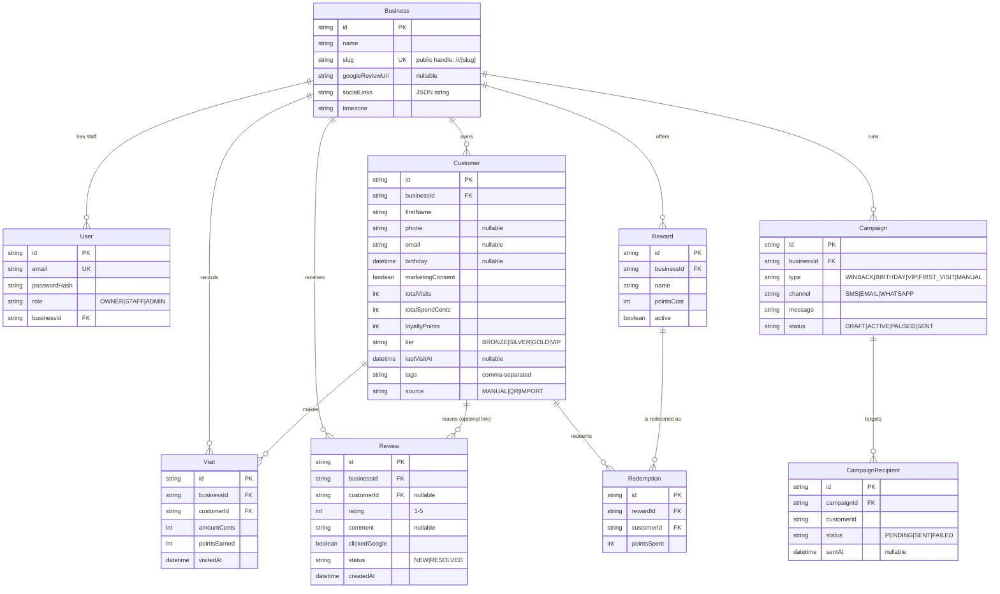

# Database Design — LoyaltyCRM

Source of truth: [`prisma/schema.prisma`](../prisma/schema.prisma).
Dev runs SQLite; production is PostgreSQL. The schema avoids enums and Json
columns so the provider switch is mechanical. Enum-like values are validated
with zod in `src/lib/validation.ts` (the single source of truth for allowed
values), and money is stored as **integer cents**.

## ER diagram

## Design decisions

- **`businessId` denormalized onto `Visit` and `Review`** even though it is
  reachable through `Customer`: reviews can exist without a customer (anonymous
  rating), and tenant-scoped queries/aggregations stay single-hop. This is the
  column every dashboard query filters on.
- **`Review` is one table for the whole funnel.** A row is created the moment
  a guest taps a star; `comment`, `clickedGoogle`, and `customerId` are filled
  in by later funnel steps. Rows with `rating <= 3 AND status = 'NEW'` form
  the "needs attention" inbox. No separate Complaint table.
- **Loyalty economics are per-business columns** on `Business`
  (`pointsPerVisit`, `silverThreshold`, `goldThreshold`, `vipThreshold`;
  defaults 10 / 5 / 10 / 20). `tierForVisits(visits, config)` in
  `src/lib/validation.ts` applies them. Tiers are still *stored* on
  `Customer` so lists/filters stay cheap; changing thresholds triggers a
  ranged bulk recompute of all customer tiers (`PATCH /api/business/loyalty`).
- **Consent is a boolean now, an audit log later.** Before Phase 4 messaging
  ships, add `ConsentEvent(customerId, channel, action, wording, ip,
  createdAt)` — required for TCPA/GDPR defensibility. Documented so we don't
  forget why.
- **Cascades:** deleting a Business cascades everywhere (GDPR-friendly
  offboarding). Deleting a Customer cascades visits/redemptions but leaves
  Reviews (`customerId → SetNull`) because ratings are business analytics.
- **No unique constraint on `Customer.phone`**: phones are optional and shared
  devices exist; dedup is handled in the funnel's merge logic (match by phone,
  else email, within the business).

## Indexes

| Table | Index | Serves |
| --- | --- | --- |
| Customer | `(businessId, lastVisitAt)` | winback segments ("no visit in 30d") |
| Customer | `(businessId, phone)` | funnel merge-by-phone |
| Customer | `(businessId, tier)` / `(businessId, createdAt)` | CRM filters, dashboards |
| Visit | `(businessId, visitedAt)` / `(customerId)` | 30-day stats, profile timeline |
| Review | `(businessId, createdAt)` / `(businessId, status, rating)` | inbox + attention filter |
| Campaign | `(businessId, status)` | Phase 4 scheduler |
| CampaignRecipient | `(campaignId, status)` | Phase 4 send loop |

## PostgreSQL migration plan (when a pilot goes live)

1. Provision Postgres (Supabase/Neon), set `DATABASE_URL`.
2. `provider = "postgresql"` in schema; delete `prisma/migrations` (SQLite
   lineage); `prisma migrate dev --name init-postgres`.
3. Optional hardening, same migration: convert enum-like Strings to real
   enums, `socialLinks` to `jsonb`, add `citext` for `User.email`.
4. Seed or CSV-import pilot data. No application code changes required.
